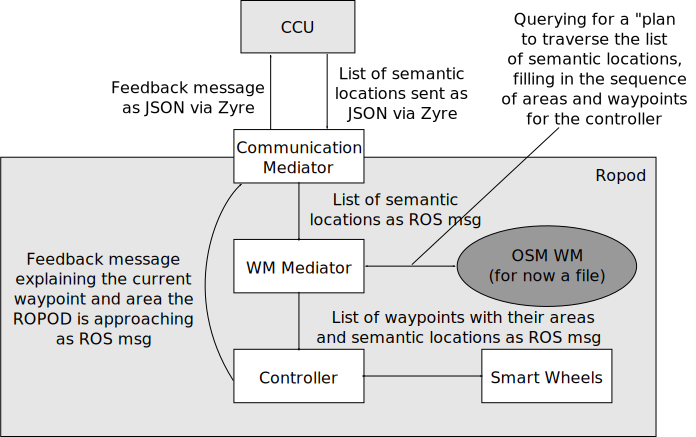

ROPOD Messages for Demo 1
=========================
The demo structure is shown in the image.



# Envelope structure

- header
 - type: STRING (required); shortcut to avoid validation of payload against metamodel 
 - version: STRING; optional version string e.g. "0.1.0"
 - metamodel: STRING; URI to payload schema
 - msg_id: choice = UUID; unique ID for traceability (required); 
- payload: JSON subpart (required) 
 - with required "metamodel" tag

# CCU command Messages

Full message example:

```
{
  "header": {
    "type": "CMD",
    "version": "0.1.0",
    "metamodel": "ropod-msg-schema.json",
    "msg_id": "0d05d0bc-f1d2-4355-bd88-edf44e2475c8",
    "timestamp": "2017-11-11T11:11:00Z"
  },
  "payload": {
    "metamodel": "ropod-demo-cmd-schema.json",
    "commandList": [
      { 
        "command": "GOTO",
        "location": "START"
      },
      { 
        "command": "GOTO",
        "location": "MOBIDIK"
      }
    ]
  }
}
```

## START

```
{
  "header": {
    "type": "CMD",
    "metamodel": "ropod-msg-schema.json",
    "msg_id": "a5339f9e-5cc4-454d-a0d3-383163dc7b45"
  },
  "payload": {
    "metamodel": "ropod-demo-cmd-schema.json",
    "commandList": [
      { 
        "command": "GOTO",
        "location": "START"
      }
    ]
  }
}
```

## MOBIDIK

```
{
  "header": {
    "type": "CMD",
    "metamodel": "ropod-msg-schema.json",
    "msg_id": "12b24ce8-db2e-4d15-a393-dded5b55e5eb"
  },
  "payload": {
    "metamodel": "ropod-demo-cmd-schema.json",
    "commandList": [
      { 
        "command": "GOTO",
        "location": "MOBIDIK"
      }
    ]
  }
}
```

## ELEVATOR

```
{
  "header": {
    "type": "CMD",
    "metamodel": "ropod-msg-schema.json",
    "msg_id": "8066f827-d297-4b8f-8939-22ffd0659f38"
  },
  "payload": {
    "metamodel": "ropod-demo-cmd-schema.json",
    "commandList": [
      { 
        "command": "GOTO",
        "location": "ELEVATOR"
      }
    ]
  }
}
```

```
{
  "header": {
    "type": "CMD",
    "metamodel": "ropod-msg-schema.json",
    "msg_id": "49525ac1-c09f-4cef-8d64-65976c80370c"
  },
  "payload": {
    "metamodel": "ropod-demo-cmd-schema.json",
    "commandList": [
      { 
        "command": "ENTER_ELEVATOR"
      }
    ]
  }
}
```

``ENTER_ELEVATOR`` is supposed to be triggered by CCU once elevator control signals the elevator has arrived. For the demo a human will trigger this."


```
{
  "header": {
    "type": "CMD",
    "metamodel": "ropod-msg-schema.json",
    "msg_id": "8d5ca928-d086-41b8-b48a-c1ab9f6b9e89"
  },
  "payload": {
    "metamodel": "ropod-demo-cmd-schema.json",
    "commandList": [
      { 
        "command": "EXIT_ELEVATOR"
      }
    ]
  }
}
```

``EXIT_ELEVATOR``: Go to an area in front of the elevator.


# Coordination Messages

```
{
  "header": {
    "type": "CMD",
    "metamodel": "ropod-msg-schema.json",
    "msg_id": "7b682bd9-41a2-4f88-a485-0fb8e6e861fb"
  },
  "payload": {
    "metamodel": "ropod-demo-cmd-schema.json",
    "commandList": [
      { 
        "command": "PAUSE"
      }
    ]
  }
}
```

```
{
  "header": {
    "type": "CMD",
    "metamodel": "ropod-msg-schema.json",
    "msg_id": "200663fa-a659-48bc-b295-b01c1680a81d"
  },
  "payload": {
    "metamodel": "ropod-demo-cmd-schema.json",
    "commandList": [
      { 
        "command": "RESUME"
      }
    ]
  }
}
```

# Plan message

```
                .... 
              .  x  . docking_area
              .......     
   --------+  ......c2 +---------------
           |  .  x  .  |
-----------+  ......   +---------------
            .......  
            .   x  ....   ......................
            .       x .   .   x          x wp1 .
junction j1 .         .   ......................
            ...........           corriddor c1
---------------------------------------       


```

Names are good for debugging but in programs we should only use the IDs.

Note: After demo Sebastian and Nico will generalize at least locations and areas to the same format for ease of use in hierarchical plans. Therefore, all have a "locationStatus" already.

```
{
  "header": {
    "type": "plan",
    "metamodel": "ropod-msg-schema.json",
    "msg_id": "200663fa-a659-48bc-b295-b01c1680a81d"
  },
  "payload": {
    "metamodel": "ropod-demo-plan-schema.json",
    "planId": "c0b5c1e1-3930-4724-ac91-cb52b6b918e7",
    "locations": [
      {
        "locationName": "MOBIDIK",
        "command": "GOTO",
        "id": "0d19dded-806f-43f0-8777-888de32507fb",
        "locationStatus": {
			"status":  "reached|approaching|pending"
			"sequenceNumber": 1,
			"totalNumber": 3 
		},
        "areas": [
          {
			"areaName": "c1"
			"id": "5dd2b820-eec2-4add-be47-3673d5d6225c",
			"locationStatus": {
			  "status":  "reached|approaching|pending"
			  "sequenceNumber": 3,
			  "totalNumber": 4
			},
			waypoints: [
			  {
			    "id": "431c3330-742d-4bc6-a73a-e3b056b7bcdd",
				"locationStatus": {
				  "status":  "reached|approaching|pending"
				  "sequenceNumber": 2,
				  "totalNumber": 5
				},
				"waypointPosition": {
				  "referenceId": "basement_map",
				  "x": 10,
				  "y": 20
				}
			  },
			  {
			  ...
			  }
			]
          },
          {
          ...
          }
        ]
      },
      {
      ...
      }
    ]
  }
}
```

# Feedback/Progress message
The id is enough to find the part of a plan this update refers to. Can refer to to any location, area, or even waypoint. Note: After demo Sebastian and Nico will generalize at least locations and areas to the same format for ease of use in hierarchical plans.

Later we want to define a progress message that has a generic part (like the sequence numbers) and a task specific part, such that at least the generic part can always be vizualised.

Should this be sent regularly or only when a status changes?


```
{
  "header":{
    "type":"progress",
    "metamodel":"ropod-msg-schema.json",
    "msg_id":"5073dcfb-4849-42cd-a17a-ef33fa7c7a69"
  },
  "payload":{
    "metamodel":"ropod-demo-progress-schema.json",
    "id": "c6c84d7d-2658-4e06-8684-7004d8d3180d",
    "status": {
      "status":  "reached"
      "sequenceNumber": 2,
      "totalNumber": 5 
	}
  }
}
```

# Robot Pose Message

```
{
  "header":{
    "type":"ROBOT-POSE-2D",
    "metamodel":"ropod-msg-schema.json",
    "msg_id":"5073dcfb-4849-42cd-a17a-ef33fa7c7a69"
  },
  "payload":{
    "metamodel":"ropod-demo-robot-pose-2d-schema.json",
    "robotId":"ropod_0",
    "pose":{
      "referenceId":"basement_map",
      "x":10,
      "y":20,
      "theta":3.1415
    }
  }
}
```

# Unit convention

Unit convention (will be added to message models in a new iteration) are *SI* units:

* position in **m**
* orientation in **RAD**

The values relate to  the *frame* as specified by ``referenceId``. For the demo this is the basement map as used by gmapping.


